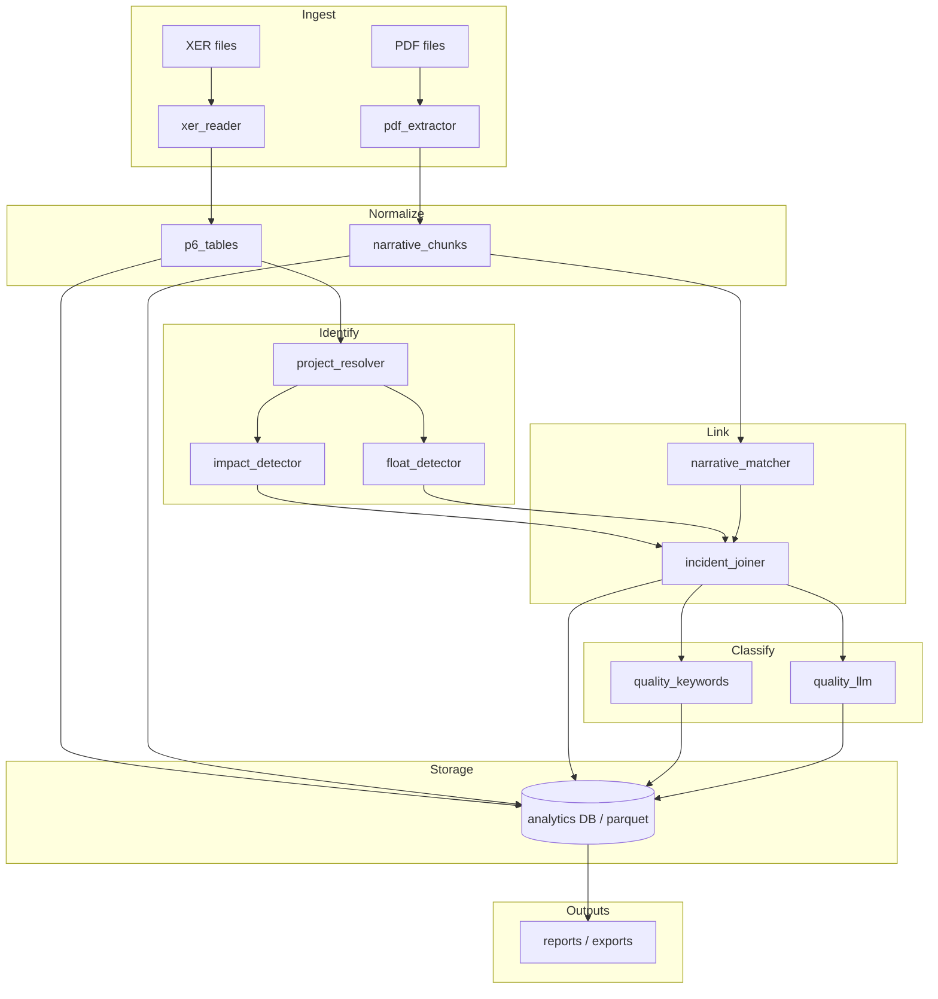

# Architecture — Schedule Impact

## 1. Purpose

This system ingests **periodic Primavera P6 exports** (`.xer`) and **companion narrative PDFs**, normalises them into a consistent analytical model, detects **schedule incidents** by comparing each month to the prior snapshot, **quantifies delay**, **links narrative text** to incidents, and **classifies** whether a linked explanation is plausibly **quality-related**.

Two incident types are first-class:

| Type | Definition | Typical signal |
|------|------------|----------------|
| **Impact incident** | A task (or driving logic) slipped vs the previous month **and** contributed to worsening the **critical path** or **project completion** | Finish slip on CP-driving activities; project end date moved |
| **Float incident** | A task finished (or is forecast to finish) **later than last month** but **did not** reduce total float below the CP threshold | `finish_variance > 0` and `total_float > 0` (or not on longest path) |

---

## 2. Context and constraints

- **XER format**: P6 `.xer` files are usually **text exports** (`%T` / `%F` / `%R`, tab-delimited). Some tools produce **SQLite** instead; this repo detects both. See [xer-schema.md](xer-schema.md) for programme-specific columns (`early_end_date`, float in hours, `driving_path_flag`, etc.).
- **PDF narratives**: Often **high-level**, **multi-topic**, and **weakly structured**. They may reference WBS areas, activity codes, contractors, or events—not always explicit P6 `task_id`s.
- **Programme scale**: A major programme may contain **multiple projects** (separate schedules or sections) and **multiple PDFs** per period.
- **Privacy**: Raw `.xer` and `.pdf` files stay **local** and **gitignored**; only derived, redacted tables belong in shared storage if needed later.

---

## 3. High-level architecture



**Execution model**: A **monthly batch pipeline** (`run_monthly`) processes one **reporting period** at a time, requiring **current** and **previous** XER for comparison. PDFs for the **same period** supply narrative context for incidents detected in that comparison.

---

## 4. Repository structure

```
schedule_impact/
├── config/
│   ├── settings.example.yaml      # Paths, thresholds, CP method
│   ├── quality_keywords.yaml        # Keyword taxonomy
│   └── project_mapping.example.yaml # Programme → project_row_id
├── data/
│   ├── raw/                         # Incoming xer/pdf (gitignored)
│   ├── staging/                     # Parsed extracts per run
│   ├── processed/                   # Normalised parquet/DB tables
│   └── reference/                   # Baselines, code lists, manual overrides
├── docs/
│   ├── architecture.md              # This document
│   └── strategy.md                  # Delivery and linking strategy
├── notebooks/                       # Exploration only
├── outputs/                         # CSV/Excel/HTML per run (gitignored)
├── scripts/
│   └── run_monthly.py               # CLI wrapper
├── sql/schema/
│   └── warehouse.sql                # Canonical DDL
├── src/schedule_impact/
│   ├── cli.py
│   ├── ingest/
│   │   ├── xer_reader.py            # SQLite open, table extract
│   │   └── pdf_extractor.py         # Text + layout blocks
│   ├── normalize/
│   │   ├── p6_tables.py             # Standard column names, types
│   │   └── narrative_chunks.py      # Sectioning, metadata
│   ├── identify/
│   │   ├── project_resolver.py      # Map rows → project_row_id
│   │   ├── impact_detector.py
│   │   └── float_detector.py
│   ├── link/
│   │   ├── narrative_matcher.py     # Text ↔ task/WBS/incident
│   │   └── incident_joiner.py
│   ├── classify/
│   │   ├── quality_keywords.py
│   │   └── quality_llm.py           # Optional enrichment
│   ├── models/
│   │   └── schemas.py               # Dataclasses / pydantic
│   └── pipeline/
│       └── run_monthly.py           # Orchestration
└── tests/
    ├── fixtures/                    # Small anonymised samples
    └── ...
```

---

## 5. Data zones

| Zone | Contents | Retention |
|------|----------|-----------|
| **raw** | Original `.xer`, `.pdf` | Source of truth; programme-controlled |
| **staging** | Per-run extracts (CSV/parquet), extraction logs | Short; rebuildable from raw |
| **processed** | Normalised fact tables, incident registry | Versioned by `reporting_period` |
| **reference** | Project mapping, activity code dictionaries, manual link overrides | Long-lived, reviewed |
| **outputs** | Human-facing reports for PM/quality teams | Per run |

**Naming convention** for inputs:

```
data/raw/xer/{programme_id}/{YYYY-MM}/schedule.xer
data/raw/pdf/{programme_id}/{YYYY-MM}/{document_id}.pdf
```

---

## 6. Canonical data model

### 6.1 Core entities

```
programme
  └── project_row          # Your stable “project row” for reporting
        └── reporting_period (month)
              ├── schedule_snapshot
              ├── task_monthly_fact
              ├── incident
              └── narrative_chunk
```

### 6.2 `project_row`

A **project row** is the unit you report against (contract section, sub-project, or row in a master tracker). It is **not** always 1:1 with a P6 `proj_id` (splits/mergers happen).

| Field | Description |
|-------|-------------|
| `project_row_id` | Internal stable ID (e.g. `PRJ-014`) |
| `programme_id` | Parent programme |
| `p6_proj_id` | Optional link to `PROJECT.proj_id` |
| `display_name` | Human label |

Resolution order: **config mapping** → **P6 PROJECT match** → **PDF metadata / filename** → **manual override** in `data/reference/overrides.csv`.

### 6.3 `schedule_snapshot`

One row per `(project_row_id, reporting_period, xer_file_hash)`.

Stores: data date, planned vs scheduled end, export timestamp, P6 version if detectable.

### 6.4 `task_monthly_fact`

Grain: `(project_row_id, reporting_period, task_id)` — with `task_id` stable across months when possible.

| Column group | Examples |
|--------------|----------|
| Identity | `task_id`, `task_code`, `task_name`, `wbs_id`, `wbs_name` |
| Dates (current) | `early_start`, `early_finish`, `late_start`, `late_finish`, `actual_start`, `actual_finish` |
| Dates (previous) | `prev_early_finish`, `prev_late_finish`, … |
| Variance | `finish_slip_days`, `start_slip_days` |
| Float | `total_float_days`, `free_float_days` |
| Criticality | `is_critical`, `on_longest_path` |
| Status | `status_code`, `percent_complete` |

**Matching tasks month-on-month**: Prefer `task_code` within the same `project_row_id`. Fallback: `(task_name, wbs_id)` with fuzzy tie-break and **match_quality** flag for audit.

### 6.5 `incident`

Grain: one logical delay event per detection rules (may aggregate multiple tasks if configured).

| Field | Description |
|-------|-------------|
| `incident_id` | UUID or `{programme}-{period}-{seq}` |
| `incident_type` | `impact` \| `float` |
| `project_row_id` | |
| `reporting_period` | Month the comparison is **for** |
| `detected_at` | Pipeline run timestamp |
| `primary_task_id` | Main slipped task |
| `related_task_ids` | JSON array if grouped |
| `delay_days` | Quantified slip (calendar or working per config) |
| `delay_metric` | e.g. `finish_slip_working_days` |
| `cp_effect_days` | For impact: contribution to project end movement |
| `severity` | Derived band (optional) |
| `previous_period` | Compared baseline month |

### 6.6 `narrative_chunk`

Grain: semantic block of PDF text (section, paragraph, or page).

| Field | Description |
|-------|-------------|
| `chunk_id` | |
| `document_id` | Source PDF |
| `project_row_id` | Resolved (nullable until matched) |
| `reporting_period` | |
| `text` | Normalised plain text |
| `page_range` | |
| `section_title` | If detected |
| `extracted_refs` | Activity codes, dates, WBS names (NER/regex) |

### 6.7 `incident_narrative_link`

Many-to-many with confidence.

| Field | Description |
|-------|-------------|
| `incident_id` | |
| `chunk_id` | |
| `link_method` | `task_memo` (direct task_id match) \| `explicit_id` \| `wbs_match` \| `code_match` \| `temporal` \| `fuzzy` \| `llm` \| `manual` |
| `confidence` | 0–1 |
| `rationale` | Short audit string |
| `memo_type_label` | MEMOTYPE label when source is `xer_taskmemo` |

`task_memo` (confidence 0.95) is the current Phase 1 linker: matches incident `primary_task_id` directly to TASKMEMO `task_id`. Higher-effort methods (`wbs_match` onward) are Phase 3+.

### 6.8 `quality_assessment`

One row per incident.

| Field | Description |
|-------|-------------|
| `incident_id` | |
| `is_quality_related` | bool |
| `quality_confidence` | 0–1 |
| `quality_signals` | Semicolon-delimited matched keywords + `ml_p=…` if ML used |
| `classifier` | `keywords` \| `ml_v1` \| `hybrid` |
| `review_status` | `auto` \| `needs_review` \| `confirmed` \| `rejected` |
| `has_linked_memo` | bool — false when incident has no linked narrative text |

Scoring logic: keyword score `= 0.4 + 0.15 × hits`, capped at 1.0, reduced by `not_quality` hits. ML (optional scikit-learn pipeline) is blended when available; ML failure logs a warning and falls back to keywords-only transparently.

---

## 7. XER extraction design

### 7.1 Minimum table set

Start with tables needed for delay and CP logic:

| Table | Use |
|-------|-----|
| `PROJECT` | Project identity, data date |
| `PROJWBS` | WBS hierarchy |
| `TASK` | Activities, dates, float, status |
| `TASKPRED` | Logic relationships (if recomputing path) |
| `TASKACTV` + `ACTVCODE` | Activity codes / custom fields |
| `CALENDAR` | Working time for day conversions |

Optional later: `RSRC`, `TASKRSRC`, `UDFVALUE` for resource or custom UDFs.

### 7.2 `xer_reader` responsibilities

1. Detect format: **text** (`%T/%F/%R`, tab-delimited) is the primary P6 export format; **SQLite** is supported as a fallback (`detect_xer_format` reads the file header).
2. Parse selected tables via `xer_text_parser` (streaming `iter_text_xer`) or `sqlite3`; return `{table_name: [row_dict, …]}`.
3. Log **schema drift** (missing columns, new tables) without failing silently.
4. Record `xer_file_hash` and metadata in `schedule_snapshot`.

> **Text parsing note:** `%R` data rows are always tab-delimited. A non-tab fallback is deliberately restricted to `%T`/`%F` header lines only; a malformed data row is returned as a single token rather than space-split to prevent silent field-offset corruption.

### 7.3 Normalisation (`p6_tasks`)

- Map P6 column names to **canonical names** via `config/p6_schema.yaml` (snake_case mapping, configurable per programme).
- Convert hour-based floats to **days** using calendar-aware helpers where P6 stores hours.
- Compute derived fields: `is_critical` (`total_float_hr_cnt ≤ threshold` **or** `driving_path_flag = 'Y'`, both configurable), `finish_slip_days` vs previous snapshot.
- Task matching uses the full `match_keys` → `match_fallback` cascade from config; keys are applied generically so any configured field (not just `task_code` / `task_id`) is respected.

---

## 8. Incident detection logic

### 8.1 Month-over-month comparison

For each `task_monthly_fact` row with a successful previous match:

```
finish_slip_days = (curr_finish.date() - prev_finish.date()).days
```

Use **early** finish for forecast comparison; use **actual** when the task status is in `completed_values` (configurable). Field names are resolved from `config/p6_schema.yaml`.

> **Delay metric:** **calendar days** (`finish_slip_calendar_days`). This is the decided metric; `CALENDAR` table integration is not planned.

**Early-exit guard:** Before classifying, the comparison skips any task whose slip is below `min(impact_slip_threshold, float_slip_threshold)`. This ensures critical tasks slipping between a low impact threshold (default 0) and a higher float threshold (default 1) are not silently dropped.

### 8.2 Float incident

```
float_incident IF:
  finish_slip_days >= float_slip_threshold   (default 1 day)
  AND NOT is_critical (current month)
```

### 8.3 Impact incident

```
impact_incident IF:
  is_critical (current month)
  AND finish_slip_days > impact_slip_threshold   (default 0 days)
```

Two-tier project-level confirmation (optional, Phase 2+):

- **Project-level confirmation**: `project_finish` moved later vs previous snapshot **and** attributable slip chain exists (trace via `TASKPRED` backward from project end).

Store `cp_effect_days` as project-end slip when task-level attribution is ambiguous.

### 8.4 Incident IDs and sequencing

Format: `{programme_id}-{reporting_period}-{incident_type}-{seq:04d}`

Impact and float incidents maintain **independent sequence counters**, so IDs are contiguous within each type (e.g. `prog-2025-04-impact-0001 … 0005` and `prog-2025-04-float-0001 … 0012`) and stable when the mix changes.

### 8.5 De-duplication

Multiple tasks slipping together may produce one **incident** grouped by:

- Same `wbs_id` + same slip week, or
- Same activity code / responsibility from `TASKACTV`

Keep grouping **conservative** early; expand after validating with SMEs.

---

## 9. PDF extraction design

### 9.1 `pdf_extractor`

- Primary: text extraction (`pdfplumber` or `pymupdf`).
- Fallback: OCR (`ocrmypdf` / `tesseract`) for scanned pages—flag `ocr_used`.
- Preserve **blocks** with bounding boxes for section detection.

### 9.2 `narrative_chunks`

Two sources, merged into one chunk model:

| Source | `source` value | Linking |
|--------|----------------|---------|
| **TASKMEMO** (XER) | `xer_taskmemo` | Direct via `task_id` / `task_code` after HTML strip |
| **PDF** | `pdf` | Section split + fuzzy / code match |

**TASKMEMO**: P6 stores `task_memo` as MSHTML; strip with `normalize/html_memo.py`, filter by `MEMOTYPE` planner labels (`config/p6_schema.yaml`).

**PDF**: Split on headings (font size / bold heuristics), numbered sections, or configured `narrative_section_headers`; run **reference extraction** for activity codes and WBS labels; attach `document_id` → `project_row_id` via filename rules.

---

## 10. Linking narratives to incidents

See `docs/strategy.md` for the full matching policy. Architecture summary:

| Priority | Method | Confidence |
|----------|--------|------------|
| 1 | Explicit task / activity code in text matches `task_code` | High |
| 2 | WBS / location name match | Medium |
| 3 | Same `project_row_id` + overlapping date window | Low–medium |
| 4 | LLM: “does this chunk explain this incident?” | Variable — requires threshold + review |

**Join** results land in `incident_narrative_link`. Unlinked incidents and orphan chunks are **expected** and reported.

---

## 11. Quality classification

**Hybrid** recommended:

1. **Keywords** (`quality_keywords.yaml`): fast, auditable, high precision for obvious cases.
2. **LLM** (`quality_llm`): for chunks above keyword ambiguity; structured JSON output (`is_quality_related`, `reason`, `confidence`).
3. **Human review queue**: `confidence < require_human_review_below`.

Do **not** treat keyword hits as legal proof—label as **analytical signal** for triage.

---

## 12. Storage and interfaces

### 12.1 Default storage

- **Phase 1**: Parquet files in `data/processed/{programme}/{period}/`.
- **Phase 2**: SQLite or DuckDB warehouse using `sql/schema/warehouse.sql`.

### 12.2 CLI

```
python -m schedule_impact.cli run-monthly \
  --programme example_programme \
  --period 2025-04 \
  --previous-period 2025-03
```

### 12.3 Outputs

All files are written to `outputs/{programme_id}/{period}/`. Each CSV always includes a header row even when zero rows are present.

| File | Contents |
|------|----------|
| `incidents_{period}.csv` | All detected incidents with delay metrics |
| `incident_memo_links_{period}.csv` | Incident ↔ chunk links with method and confidence |
| `quality_assessment_{period}.csv` | Quality flags, confidence, and review status per incident |
| `run_manifest.json` | Input hashes, config, row counts, pipeline timestamp |

Optional later: HTML summary dashboard.

---

## 13. Cross-cutting concerns

| Concern | Approach |
|---------|----------|
| **Auditability** | Store `link_method`, `rationale`, source hashes, config version |
| **Schema drift** | Table/column presence report per ingest |
| **Idempotency** | Re-run overwrites `processed/{period}` with same inputs |
| **Testing** | Small anonymised XER + PDF fixtures; golden files for incident counts |
| **Security** | No secrets in repo; LLM keys via env; raw data gitignored |

---

## 14. Technology choices (recommended)

| Layer | Choice | Rationale |
|-------|--------|-----------|
| Language | Python 3.11+ | Ecosystem for PDF/SQLite/data |
| XER | `sqlite3` + pandas/polars | Native format |
| PDF | `pymupdf` or `pdfplumber` | Text + layout |
| Data frames | **Polars** or pandas | Fast monthly joins |
| Validation | **Pydantic** | Schema for config and outputs |
| LLM (optional) | Provider SDK behind interface | Swappable |
| Packaging | `pyproject.toml` + `src` layout | Standard |

---

## 15. Extension points

- **UDF / custom fields** in XER for “delay reason” already coded in P6—use as ground truth when present.
- **EVM** or progress curves (future) — separate module.
- **API layer** (future) — read-only over processed parquet/DB.
- **Power BI / Excel** — consume `outputs/` CSVs.

---

## 16. Open decisions (track in issues)

1. ~~Working vs calendar days~~ — **decided: calendar days** (`finish_slip_calendar_days`). `CALENDAR` integration is not required.
2. Whether impact incidents require **project end movement** or critical-task slip alone.
3. Grouping rules for multi-task incidents.
4. LLM budget and whether narratives contain **PII** requiring redaction before cloud calls.
5. Settings discovery — if `config/settings.yaml` is absent the pipeline silently falls back to `settings.example.yaml` defaults. Decide whether a missing settings file should warn or fail.
