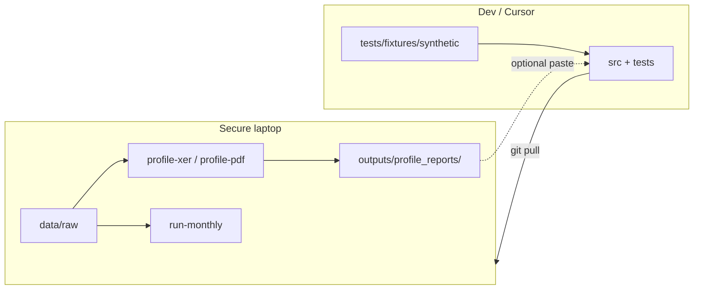

# Developing with sensitive programme data

You can build and run this repo entirely on a laptop that holds real XER and PDF files. **No programme content needs to enter Cursor or any cloud chat** for most development to proceed.

## Split of responsibilities

| Where | What happens |
|-------|----------------|
| **This repo (any machine)** | Code, tests on **synthetic** fixtures, schema design, review |
| **Your secure laptop** | Real files under `data/raw/`, local runs, anonymized **profile reports** only if you choose to share them |
| **Cursor / chat** | Paste **structure-only** artifacts (see below), errors, and code — never raw PDF text or schedule rows |

## What you can share safely (optional)

These help tune parsers and rules **without** exposing programme identity or commercial detail:

1. **`profile-all` JSON** — combined XER + PDF structure report. Covers items 2–4 below in a single command. Recommended for Phase 2 development.
2. **`profile-xer` JSON** — table names, column names, row counts, null rates, MEMOTYPE labels, activity code type names. No task/activity values.
3. **`profile-xer --pair`** — month-on-month **match statistics** (e.g. “87% of tasks matched by `task_code`”). No task codes or names.
4. **`profile-pdf` JSON** — page count, section headings with level and page number, per-section body character count and table shapes, activity-code-like count. **Section headings are included** — they are structural metadata equivalent to a document ToC and contain no narrative content.
5. **Redacted config** — copy `config/project_mapping.yaml` with real names replaced by `PROJECT_A`, `PROJECT_B`.
6. **Stack traces** and test failures from synthetic tests (always safe).

## What must stay local

- Raw `.xer` and `.pdf` files
- Full `profile` output if you disable redaction flags
- Exported `incidents_*.csv`, `narrative_chunk` text, or any output containing task names, dates tied to scope, or narrative excerpts
- LLM calls that include narrative body text (unless you use a **local** model on the laptop)

## Recommended workflow



### 1. On the secure laptop (once per programme, then when schema drifts)

```bash
pip install -e ".[dev]"

# Recommended: combined XER + PDF report in one command
schedule-impact profile-all \
  --programme MY_PROGRAMME \
  --xer data/raw/xer/PROGRAMME/2025-04/schedule.xer \
  --previous-xer data/raw/xer/PROGRAMME/2025-03/schedule.xer \
  --pdf data/raw/pdf/PROGRAMME/2025-04/narrative.pdf \
  --out outputs/profile_reports/2025-04-combined.json

# XER only (if no PDF yet, or to add a second period)
schedule-impact profile-xer \
  --xer data/raw/xer/PROGRAMME/2025-04/schedule.xer \
  --pair data/raw/xer/PROGRAMME/2025-03/schedule.xer \
  --out outputs/profile_reports/2025-04-xer.json

# PDF only
schedule-impact profile-pdf \
  --pdf data/raw/pdf/PROGRAMME/2025-04/narrative.pdf \
  --out outputs/profile_reports/2025-04-pdf.json
```

Review the JSON yourself before sharing. The profile reports are designed to contain only structural metadata (table names, column names, section headings, counts) — no schedule rows, no task names, no narrative text.

### 2. In the repo (everywhere, including Cursor)

- All feature work is driven by **`tests/fixtures/synthetic/`** (fake SQLite XER + minimal PDF).
- CI and `pytest` never touch `data/raw/`.
- When real data reveals a new edge case, **add a synthetic example** that reproduces the *shape* of the problem (e.g. renamed `task_code`, missing `TASKPRED`), not the real values.

### 3. Closing the loop after a local run

On the laptop, after `run-monthly`:

- Check **counts only**: number of impact vs float incidents, % linked, % quality-flagged.
- If something looks wrong, describe the issue in chat in abstract terms: e.g. “critical tasks use `total_float_hr_cnt` in hours; float threshold 0 still marks many float incidents.”
- Optionally share a **single anonymized row** you typed by hand (fake IDs/dates).

## Regenerating synthetic fixtures

Synthetic data is committed so tests run without your files:

```bash
python scripts/build_synthetic_fixtures.py
```

Edit the script to mirror new schema discoveries from profile reports (new columns, tables).

## LLM use on sensitive narratives

If you enable Phase 5:

| Approach | Data leaves laptop? |
|----------|---------------------|
| Keywords only | No |
| Local LLM (Ollama, etc.) | No |
| Cloud API | Yes — **do not** unless legal/IT approve; redact or summarize locally first |

Default config keeps `llm_model: null`.

## Git and remotes

- Prefer a **private** remote if the repo might ever contain accidental paths, config names, or profile snippets.
- `.gitignore` already excludes `data/raw/`, `data/staging/`, `data/processed/`, and `outputs/`.
- Never commit `config/settings.yaml` if it contains hostnames or internal paths you consider sensitive.

## TASKMEMO labeling and ML

Export planner memos for local team review, then train a classifier — see [memo-labeling-and-ml.md](memo-labeling-and-ml.md). Labeled CSVs and models stay under `outputs/labeling/` (gitignored). You may share **aggregate** stats (e.g. “20% quality in 400 labeled memos”) in chat, not memo text.

## How we still make progress in Cursor

| Need | Approach without real data |
|------|----------------------------|
| XER table/column names | Your profile JSON **or** synthetic fixture + Primavera P6 public docs |
| Month-on-month logic | Synthetic two-month pair in `tests/fixtures/synthetic/` |
| Impact vs float rules | Unit tests with known float/critical flags in synthetic tasks |
| PDF structure | Synthetic PDF in fixtures; profile PDF for section **counts** on laptop |
| Linking / quality | Tests with fake chunk text; keyword list reviewed by you locally |
| “It fails on real data” | Abstract description + profile JSON; we adjust code and you re-run |

You remain the **integration tester** on real data; the repo remains the **auditable implementation** validated on synthetics and structure reports.
