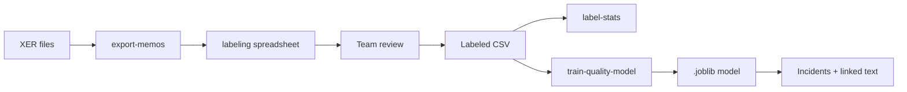

# TASKMEMO labeling and quality ML

Use this workflow to build a **programme-specific** quality classifier from planner notes, then apply it to schedule incidents (via linked memos or PDF text).

All steps run **on your laptop** — exported CSVs contain sensitive text and must not be committed.

## Overview



## Step 1 — Bulk export memos

```bash
# Recommended: only memos on tasks that slipped vs last month
schedule-impact export-memos \
  --programme your_programme \
  --xer data/raw/xer/your_programme/2025-04/schedule.xer \
  --previous-xer data/raw/xer/your_programme/2025-03/schedule.xer \
  --slipped-only \
  --min-slip-days 1 \
  --out outputs/labeling/memos_slipped_to_label.csv

# Full export (large — usually not needed for labeling)
schedule-impact export-memos \
  --programme your_programme \
  --xer data/raw/xer/your_programme/2025-04/schedule.xer \
  --out outputs/labeling/memos_all.csv
```

Use `--min-slip-days 3` if you only want tasks slipped by several calendar days.

Default export filters to **planner memo types** in `config/p6_schema.yaml`. Use `--all-memo-types` to include every `MEMOTYPE`.

Output columns include empty fields for the team:

| Column | Who fills | Values |
|--------|-----------|--------|
| `is_quality_related` | Reviewer | `yes` / `no` (see below) |
| `quality_notes` | Reviewer | Optional reason |
| `labeled_by` | Reviewer | Initials |
| `labeled_at` | Reviewer | `YYYY-MM-DD` |

Accepted truthy: `yes`, `y`, `true`, `1`, `quality`  
Accepted falsy: `no`, `n`, `false`, `0`, `not_quality`

## Step 2 — Team labeling

**Tips for consistent labels**

- **Quality-related**: delay driven by defects, rework, failed inspection, NCR, snagging, remedial work, quality hold, etc.
- **Not quality-related**: access, weather, permits, design change, client instruction, resource shortage (unless clearly caused by quality rework).

**Sampling**

- Start with **200–500** diverse memos across projects and memo types.
- Aim for balance if possible; imbalanced data is OK for v1 (classifier uses `class_weight=balanced`).

**Tooling**

- Excel / Google Sheets (local copy only) on the CSV.
- Optional: split CSV by `memo_type_label` for different reviewers.

## Step 3 — Stats (% quality in sample)

```bash
schedule-impact label-stats \
  --labels outputs/labeling/memos_labeled.csv \
  --out outputs/labeling/label_stats.json
```

Example output:

```json
{
  "total_rows": 450,
  "labeled_rows": 420,
  "unlabeled_rows": 30,
  "quality_yes": 84,
  "quality_no": 336,
  "quality_rate": 0.2,
  "by_memo_type": { "Planners Notes (CP)": { "yes": 40, "no": 120 } }
}
```

That answers **(A) what % of the labeled sample are quality issues**.

## Step 4 — Train baseline model

```bash
pip install -e ".[ml]"

schedule-impact train-quality-model \
  --labels outputs/labeling/memos_labeled.csv \
  --model outputs/labeling/models/quality_classifier.joblib \
  --report outputs/labeling/train_report.json
```

- **Algorithm**: TF–IDF (1–2 grams) + logistic regression.
- **Minimum**: at least one `yes` and one `no`; **≥20** labeled rows recommended before trusting metrics.
- Report includes hold-out **accuracy** and **F1 (quality class)**.

This addresses **(B) ML flagging** for any text with the same distribution as TASKMEMO (linked to incidents later).

## Step 5 — Apply to incidents (`run-monthly`)

```bash
schedule-impact run-monthly \
  --programme your_programme \
  --period 2025-04 \
  --previous-period 2025-03 \
  --current-xer data/raw/xer/.../2025-04/schedule.xer \
  --previous-xer data/raw/xer/.../2025-03/schedule.xer \
  --quality-model outputs/labeling/models/quality_classifier.joblib
```

Outputs under `outputs/{programme}/{period}/`:

- `incidents_{period}.csv`
- `incident_memo_links_{period}.csv`
- `quality_assessment_{period}.csv`
- `run_manifest.json`

Set `quality.model_path` in `config/settings.yaml` to avoid passing `--quality-model` each run.

PDF-only incidents can use the same model later but expect **lower recall** (different writing style).

## Improving the model

| Stage | Action |
|-------|--------|
| v1 | Logistic regression on TF–IDF (current) |
| v2 | Add labeled PDF snippets to training CSV (`source=pdf`) |
| v3 | Small fine-tuned transformer **only** if IT approves on-prem/cloud |
| Ongoing | Re-export misclassified rows, relabel, retrain monthly |

## Governance

- Do **not** commit `outputs/labeling/*.csv` or models with production text.
- `data/reference/memo_labels.template.csv` is column guide only (no real text).
- Share **aggregate** stats (quality_rate, counts) in chat if needed — not memo bodies.

## Gitignored paths

```
outputs/labeling/
data/reference/memo_labels*.csv
!data/reference/memo_labels.template.csv
```
