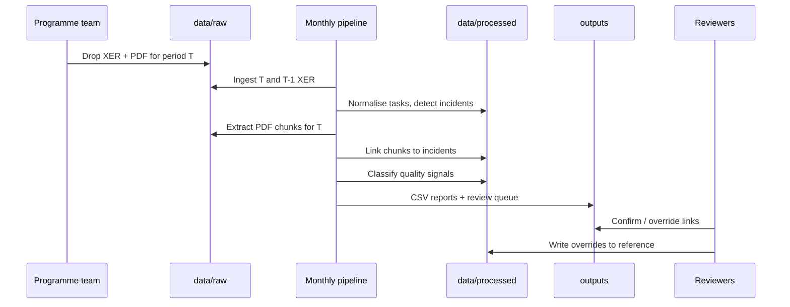

# Strategy — Schedule Impact

> **Looking for how-to-use instructions?** This document covers strategic
> approach and validation. The step-by-step cookbook (install, profile,
> run, validate, troubleshoot) lives in
> [`schedule-impact-user-guide.md`](schedule-impact-user-guide.md).

## 1. Problem statement

A major programme produces **monthly P6 schedule files** and **companion PDF narratives** that should explain delays. In practice, narratives are often **broad or vague**, while the schedule contains **precise date and float mechanics**. The goal is to:

1. **Detect** where the schedule changed adversely vs last month.
2. **Distinguish** critical **impact** from non-critical **float** consumption.
3. **Quantify** delay in a consistent unit (working days recommended).
4. **Link** narrative text to each incident for explainability.
5. **Flag** incidents whose linked (or nearby) narrative suggests **quality** as a contributing factor.

Success is measured by **useful triage**, not perfect automation: SMEs will still adjudicate edge cases.

---

## 2. Guiding principles

| Principle | Implication |
|-----------|-------------|
| **Schedule is ground truth for “what slipped”** | Incidents are derived from XER comparison, not from PDF claims. |
| **Narrative is ground truth for “why they said it slipped”** | Text explains; it does not create incidents. |
| **Assume weak linkage** | Many incidents will have no narrative; many narrative paragraphs will match no incident. |
| **Audit over automation** | Every link and quality flag stores method, confidence, and rationale. |
| **Iterate with real samples** | First 2–3 months of data drive mapping rules before scaling. |

---

## 3. Definitions

### 3.1 Project row

The **project row** is your reporting grain—aligned to how the programme tracks sections in progress meetings (may map to one P6 project, a WBS subtree, or a PDF section).

**Identification workflow:**

1. Inventory unique `PROJECT` rows across sample XERs.
2. Inventory PDF filenames, cover pages, and recurring section titles.
3. Build `config/project_mapping.yaml` (from `project_mapping.example.yaml`).
4. Maintain `data/reference/overrides.csv` for exceptions.

### 3.2 Reporting period

A **calendar month** (or programme-defined “period”) labelled `YYYY-MM`. Each run compares:

- **Current**: schedule data date falling in period *T*
- **Previous**: period *T−1* snapshot

If exports are irregular, strategy is: **pair closest prior snapshot** by `data_date`, not strict calendar—log the pairing used.

### 3.3 Impact incident

An **impact incident** means the programme’s **time position worsened in a way that matters to completion**—not merely that a non-critical task moved.

**Recommended detection rule (v1):**

- Critical-path task (`total_float ≤ 0` or longest-path member) has **positive finish slip** vs previous month, **or**
- **Project/plan end** (from `PROJECT` or root milestone) slipped later by ≥ 1 working day **and** at least one critical task slipped.

**Quantification:**

| Metric | Use |
|--------|-----|
| `delay_days` | Primary task `finish_slip` (working days) |
| `cp_effect_days` | Project end slip when task-level attribution is unclear |

### 3.4 Float incident

A **float incident** is a **real slip** that **did not** turn the task critical:

- `finish_slip_days ≥ threshold` (default 1)
- Task remains **non-critical** with float remaining

These are valuable for **early warning** and for quality themes that do not yet hit CP (e.g. rework on parallel paths).

### 3.5 Quality-related incident

An incident is **quality-related** when linked narrative (or incident-adjacent chunks on the same `project_row_id`) contains **quality signals** above confidence threshold.

This is **not** a root-cause legal finding—it is a **prioritisation flag** for quality managers.

---

## 4. End-to-end workflow



---

## 5. Phased delivery

### Phase 0 — Discovery (1–2 weeks)

**Inputs:** 2–3 consecutive monthly XER pairs + matching PDFs.

| Activity | Output |
|----------|--------|
| Profile XER tables/columns | `docs/xer_profile_{programme}.md` (optional) |
| List `task_code` stability month-on-month | Match rate % |
| Read sample narratives | Section structure, typical vagueness |
| Draft `project_mapping.yaml` | ≥80% rows auto-resolved |
| Agree delay metric | Working vs calendar days |

**Exit criteria:** Stakeholders agree on impact vs float definitions and project row list.

### Phase 1 — Schedule analytics (MVP) ✓ complete

**Scope:** XER only — no PDF, no LLM.

- Extract core tables → `task_monthly_fact`
- Detect impact and float incidents (text + SQLite XER; configurable criticality and slip thresholds)
- TASKMEMO narrative chunks extracted and linked to incidents by `task_id`
- Quality keyword scoring with optional scikit-learn hybrid
- Export `incidents_{period}.csv`, `incident_memo_links_{period}.csv`, `quality_assessment_{period}.csv`, `run_manifest.json`
- CLI (`schedule-impact run-monthly`), profiling tools, synthetic test fixtures

**Delay metric:** calendar days (`finish_slip_calendar_days`) — decided.

### Phase 2 — PDF ingest and chunking ← current priority

**Scope:** Text extraction + `narrative_chunk` table; project row on document/section.

- No incident linking yet
- Report chunks with `extracted_refs` (codes, dates, WBS labels via regex/NER)
- `pdf_extractor.py` stub exists; needs full implementation

**Exit criteria:** Chunks readable and section boundaries sensible; `extracted_refs` populated for ≥50% of chunks.

### Phase 3 — Deterministic linking

**Scope:** Code/WBS/date matching from PDF chunks (TASKMEMO → task_id linking already live from Phase 1).

- Extend `incident_narrative_link` with `wbs_match`, `code_match`, `temporal`, `fuzzy` methods
- Unlinked incident report

**Exit criteria:** ≥30–50% of **impact** incidents get at least one medium+ confidence link (programme-dependent target).

### Phase 4 — Quality keyword tuning

**Scope:** Validate and tune `quality_keywords.yaml` against real programme data.

- `quality_assessment` per incident already produced by Phase 1
- Review queue workflow (`needs_review` rows) tested with quality team
- Iterate keyword lists based on confirmed/rejected labels

**Exit criteria:** Quality team validates precision on sample of 20 flags.

### Phase 5 — LLM enrichment (optional)

**Scope:** Ambiguous links and quality interpretation.

- Prompt: given incident JSON + chunk text → structured assessment
- **Never** auto-create incidents from LLM
- Redact PII if sending to cloud

**Exit criteria:** Improved link/quality recall without unacceptable false positives.

---

## 6. Linking strategy (narrative ↔ incident)

### 6.1 Why linking is hard

- PDFs discuss **themes** (“MEP coordination”, “concrete defects”) not **task codes**.
- One paragraph may cover **multiple** delays.
- The same incident may be **silent** in narrative (schedule-only slip).

### 6.2 Matching cascade

Apply in order; stop at first hit above threshold unless config says accumulate evidence:

| Step | Rule | `link_method` | Typical confidence |
|------|------|---------------|-------------------|
| A | Regex activity / task codes in chunk == `task_code` | `explicit_id` | 0.9–1.0 |
| B | Extracted WBS / location string == `wbs_name` (normalised) | `wbs_match` | 0.7–0.85 |
| C | Activity code type fields from `TASKACTV` match tokens in text | `code_match` | 0.65–0.8 |
| D | Date phrase in text overlaps `[prev_finish, curr_finish]` window | `temporal` | 0.5–0.65 |
| E | Same `project_row_id`, period, and keyword overlap with incident task name | `fuzzy` | 0.4–0.6 |
| F | LLM pairwise scorer incident ↔ chunk | `llm` | model-dependent |

**Threshold:** persist links with `confidence ≥ 0.6`; flag `0.4–0.6` for review only.

### 6.3 One-to-many policy

- One incident → **multiple chunks** allowed (executive summary + detail).
- One chunk → **multiple incidents** allowed with separate link rows.
- Cap links per incident (e.g. top 5 by confidence) to avoid noise.

### 6.4 Human overrides

`data/reference/narrative_links_manual.csv`:

```
incident_id,chunk_id,action,reviewer,date
INC-2025-04-001,CHK-abc,confirm,S.Name,2025-05-01
```

Pipeline merges manual rows with **confidence = 1.0**, `link_method = manual`.

---

## 7. Quality identification strategy

### 7.1 Two-stage classifier

**Stage 1 — Keywords (always on)**

- Scan linked chunks; if none, scan all chunks for same `project_row_id` within ±1 period.
- Score = weighted hits from `quality_keywords.yaml` minus `not_quality` hits (optional down-rank).

**Stage 2 — LLM (optional)**

Use when:

- Keyword score in grey zone (e.g. 0.3–0.7), or
- High-impact incident with **no** keyword signal but rich narrative

**Structured output:**

```json
{
  "is_quality_related": true,
  "confidence": 0.82,
  "themes": ["rework", "inspection failure"],
  "evidence_span": "short quote"
}
```

### 7.2 Avoiding false confidence

| Risk | Mitigation |
|------|------------|
| Vague “quality” talk without schedule effect | Require incident link OR explicit task reference |
| Generic HSE/quality boilerplate | Down-rank chunks from standard headers (config blocklist) |
| Non-quality delay mis-tagged | `not_quality` keywords reduce score; SME review |

### 7.3 Review workflow

Export `quality_review_{period}.csv` columns:

- `incident_id`, `delay_days`, `incident_type`, top chunk excerpt, `quality_confidence`, `review_status`

SME sets `review_status = confirmed | rejected` → feeds next month’s keyword tuning.

---

## 8. Quantifying delay

### 8.1 Recommended default

**Working days** between comparable finish fields, using P6 **calendar** on the task:

- Forecast comparison: `early_finish` vs `prev_early_finish`
- Actualised: `actual_finish` vs `prev_actual_finish` when both exist

Document exceptions (milestones, LOE tasks) in `data/reference/task_exclusions.csv`.

> **Decided metric: calendar days** (`finish_slip_calendar_days`).

### 8.2 Multiple metrics (optional)

Store secondary metrics without changing primary:

- `delay_calendar_days`
- `delay_percent_of_original_duration`

### 8.3 Project-level impact

When project end moves:

```
cp_effect_days = working_days_between(prev_project_end, curr_project_end)
```

Attribute narrative priority to incidents with highest `cp_effect_days` when text is programme-level.

---

## 9. Data governance

| Topic | Policy |
|-------|--------|
| **Storage** | Raw files local; no commit to git |
| **Retention** | Align with programme IT; staging rebuildable |
| **PII** | Strip before LLM; log redaction version |
| **Versioning** | Tag pipeline `git` SHA in every output manifest |
| **Reproducibility** | `run_manifest.json` per period: input hashes, config hashes, row counts |

---

## 10. Validation and KPIs

### 10.1 Schedule QA (each run)

- % tasks matched month-on-month
- Count new/deleted tasks
- Distribution of `finish_slip_days`
- Sum of impact `delay_days` vs project end slip (sanity check)

### 10.2 Linking QA (monthly sample)

Manual review of **n = 30** incidents:

| KPI | Target (illustrative) |
|-----|------------------------|
| Impact incidents with ≥1 usable narrative link | ≥40% by Phase 3 |
| Precision of links (confirmed / reviewed) | ≥70% |
| False quality flags | <20% after tuning |

### 10.3 Stakeholder outputs

**For planning:** impact incidents sorted by `cp_effect_days`  
**For quality:** quality-flagged incidents with linked text excerpts  
**For transparency:** unlinked incidents report (schedule moved, narrative silent)

---

## 11. Risk register

| Risk | Likelihood | Impact | Mitigation |
|------|------------|--------|------------|
| Unstable `task_code` between exports | Medium | High | Fallback matching; match_quality flag |
| Narrative too vague to link | High | Medium | Accept lower link rate; SME overrides |
| Wrong CP identification | Medium | High | Validate against P6 client CP; configurable method |
| Over-trust in LLM quality labels | Medium | High | Keywords first; mandatory review queue |
| Multiple projects in one XER | Medium | Medium | `project_resolver` + mapping file |
| Scanned PDFs | Medium | Medium | OCR path; flag low text confidence |

---

## 12. Team roles (suggested)

| Role | Responsibility |
|------|----------------|
| **Planning lead** | Validates impact vs float rules and thresholds |
| **Quality lead** | Tunes keywords, reviews quality queue |
| **Data engineer** | Pipeline, schema, reproducibility |
| **PMO** | Maintains project row mapping and file naming |

---

## 13. Immediate next steps

Phase 1 is complete. Priorities in order:

1. ~~Agree delay metric~~ — **decided: calendar days** (`finish_slip_calendar_days`).
2. **Create `config/settings.yaml`** from `settings.example.yaml`; tune `impact_slip_threshold_days` and `float_slip_threshold_days` against first real run output.
3. **Run Phase 1 on real data** — `schedule-impact run-monthly` with two consecutive XERs; review `incidents_*.csv` with planners and spot-check 10 tasks.
4. **Phase 2: implement `pdf_extractor.py`** — text extraction, section chunking, `extracted_refs` (activity codes, dates). `narrative_chunks.py` schema and `narrative_chunk` model are already in place.
5. **Tune quality keywords** — after first real run, review `needs_review` rows with the quality team and update `config/quality_keywords.yaml`.
6. **Phase 3: extend linker** — add `wbs_match` and `code_match` methods to `link/narrative_matcher.py` once PDF chunks are available.

---

## 14. Sensitive data and remote collaboration

Real programme files must not be committed or pasted into cloud assistants. Development proceeds as follows:

- **Local laptop**: ingest, `profile-xer` / `profile-pdf`, and `run-monthly` on real files.
- **Repository / Cursor**: code and tests against **synthetic** fixtures; optional sharing of **anonymized profile JSON** only.

Full workflow: [development-with-sensitive-data.md](development-with-sensitive-data.md).

---

## 15. Document maintenance

| Document | Update when |
|----------|-------------|
| `architecture.md` | Schema, modules, or storage changes |
| `strategy.md` | Business rules, KPIs, or phase scope changes |
| `quality_keywords.yaml` | After each review cycle |
| `project_mapping.yaml` | New projects or reorganisations |
| `development-with-sensitive-data.md` | Changes to profiling or sharing policy |
